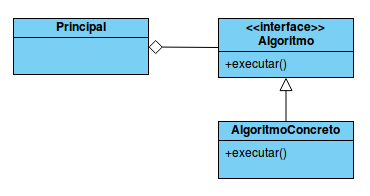
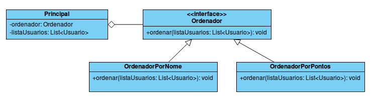

### Classes Abstratas

Uma classe abstrata não pode ser instanciada, em outras palavras, você não pode usar new para criar objetos a partir dela. Criamos classes desse tipo para serem estendidas por outras classes.

Se você deseja tornar uma classe abstrata basta usar a palavra abstract em sua definição:

```java
public abstract class Animal { }
```
Uma classe definida como abstrata pode ter métodos igualmente abstratos(sem implementação) e métodos não abstratos(com implementação). Os métodos abstratos serão sobrescritos e implementados pelas filhas da classe abstrata. Quando usamos a palavra filhas nesse contexto, quer dizer as classes concretas que irão herdar da classe abstrata(usando a palavra extends). Vejamos um exemplo para ficar tudo mais claro.

Iremos criar uma classe Animal que terá uma variável mamifero do tipo boolean para guardar um valor true ou false indicando se o animal é ou não é um mamífero. Criaremos um getter e um setter para essa variável também para manter o encapsulamento. Além disso a classe Animal terá um método comer() que não será abstrato pois vamos aplicar um comportamento exatamente igual para todos animais que herdarem dessa classe. Afinal para esse programa não nos importa qualquer diferença entre o modo de comer de cada animal, portanto teremos um comportamento comer() mais genérico que serve para todos. Já o outro método chamado fazerSom() será marcado como abstract pois cada animal faz um som diferente(alguns relincham, outros rugem, etc). Portanto o comportamento de fazer algum som terá que ser implementado nas classes filhas.

####### Animal.java

```java
public abstract class Animal {
	
	private boolean mamifero;

	public boolean isMamifero() {
		return mamifero;
	}

	public void setMamifero(boolean mamifero) {
		this.mamifero = mamifero;
	}
	
	public void comer() {
		System.out.println("comendo...");
	}
	
	public abstract void fazerSom();

}
```
Agora que temos a classe Animal criada mas não podemos "dar new" nela, vamos criar uma classe concreta - entenda por concreta uma classe não abstrata - que irá estender Animal. Veja como poderia ser uma classe Cavalo que sobrescreve o método fazerSom() da classe pai Animal.

####### Cavalo.java

```java
public class Cavalo extends Animal {

	@Override
	public void fazerSom() {
		System.out.println("relinchando...");		
	}

}
```

Podemos criar uma segunda classe que herda de Animal, nesse caso Leao, e que também irá prover sua própria implementação do método fazerSom().

####### Leao.java

```java
public class Leao extends Animal {

	@Override
	public void fazerSom() {
		System.out.println("rugindo...");		
	}

}
```

Agora uma classe chamada Principal que tem o método main onde vamos testar tudo que fizemos até agora. Veja que tanto a classe Cavalo como a classe Leao, herdaram todas as coisas da classe Animal. Além disso elas forneceram sua própria lógica para fazerSom().

####### Principal.java

```java
public class Principal {

	public static void main(String[] args) {
		// Animal a = new Animal(); //Isso resultaria em ERRO de compilação
		
		Cavalo c = new Cavalo();
		c.setMamifero(true);
		c.comer();
		c.fazerSom();
		System.out.println("cavalo eh mamifero? " + c.isMamifero());
		
		Leao l = new Leao();
		l.setMamifero(true);
		l.comer();
		l.fazerSom();
		System.out.println("leao eh mamifero? " + c.isMamifero());
	}

}
```
O código acima gera o seguinte output:

```sh
comendo...
relinchando...
cavalo eh mamifero? true
comendo...
rugindo...
leao eh mamifero? true
```

É importante dizer que se apenas um método for abstrato, a classe deve ser abstrata. Também é válido ressaltar que uma classe abstract não pode ser final ao mesmo tempo, já que são coisas opostas.

### Interfaces

Considere uma interface como uma classe 100% abstrata, porém você deve utilizar a palavra interface no lugar de class na sua definição:

```java
public interface Carro { }
```
As variáveis declaradas em uma interface são sempre constantes, ou seja, mesmo que não especifiquemos elas são sempre public static final.

Os métodos declarados em uma interface são sempre públicos e abstratos, independente de indicarmos isso ou não. Isso não se aplica a métodos default ou static que podem existir dentro de interfaces a partir do Java 8(falo um pouco sobre [métodos default e static em interfaces nesse link](https://horadedebugar.blogspot.com/2019/08/java-8-expressoes-lambda-e-interfaces.html)).

####### Carro.java

```java
public interface Carro {
	
	int quantidadeDeRodas = 4; //é implicitamente public static final
	public static final String paisDeFabricacao = "Brasil"; //declarando de forma mais explícita
	
	void acelerar(); //implicitamente public abstract
	public abstract void freiar(); //declarando de forma mais explícita

}
```
Ao implementar a interface é necessário prover uma implementação para cada um de seus métodos abstratos:

####### Ferrari.java

```java
public class Ferrari implements Carro {

	public void acelerar() {
		System.out.println("Ferrari acelerando. Chego a 325 km/h.");		
	}

	public void freiar() {
		System.out.println("Ferrari freiando.");		
	}

}
```

Segue classe que faz usa da interface Carro e da classe Ferrari que a implementa:

####### Principal.java

```java
public class Principal {

	public static void main(String[] args) {
		Ferrari f = new Ferrari();
		System.out.printf("Qtde. de rodas: %d, País de Fabricação: %s\n", 
				Ferrari.quantidadeDeRodas, Ferrari.paisDeFabricacao);
		f.acelerar();
		f.freiar();
	}

}
```
Ao executar esse código obtemos o seguinte output:

```sh
Qtde. de rodas: 4, País de Fabricação: Brasil
Ferrari acelerando. Chego a 325 km/h.
Ferrari freiando.
```

Alguns pontos importantes:

- Os métodos declarados em uma interface são abstratos, portanto não podem ser final.
- Uma interface pode estender uma ou mais interfaces.
- Uma interface não pode estender nada que não seja uma interface.
- Uma interface não pode implementar nem outra interface nem outra classe.
- Posso usar a palavra abstract na definição da interface, mas isso é considerado redundante, pois as interfaces são implicitamente abstract.

### Exercício

O objetivo do exercício é ver na prática como usar uma interface, ao mesmo tempo utilizaremos o polimorfismo e o design pattern Strategy.

O Strategy é um padrão que deve ser utilizado quando uma classe possuir diversos algoritmos que possam ser utilizados de forma intercambiável. A solução proposta pelo padrão consiste em delegar a execução do algoritmo para uma instância que compõe a classe principal.



1. Criar uma classe Usuario com duas variáveis de instância nome do tipo String e pontos do tipo int com seus respectivos getters e setters. Essa classe deve sobrescrever o método toString e conter um construtor que use os dois campos(nome e pontos).

2. Crie uma interface chamada Ordenador com um único método nomeado ordenar com retorno void que recebe uma lista de Usuario.

3. Cria uma classe chamada OrdenadorPorNome que implementa a interface Ordenador. Você deve sobrescrever o método ordenar e escrever a lógica para ordenar a lista recebida no argumento do método pelo nome de cada Usuario.

4. Cria uma classe chamada OrdenadorPorPontos que implementa a interface Ordenador. Você deve sobrescrever o método ordenar e escrever a lógica para ordenar a lista recebida no argumento do método pelos pontos de cada Usuario.

5. Criar uma classe Principal que contém uma lista de Usuario e um Ordenador como variáveis de instância. No construtor receba um Ordenador e atribua a respectiva variável de instância. Ainda no construtor inicialize a lista de Usuario com 3 usuários diferentes. Essa classe também deve ter um setter para o campo Ordenador. Essa classe também deve ter um método ordenarLista() que delega o trabalho de ordenar a lista ao Ordenador e logo em seguida mostra a lista ordenada.

6. Ainda na classe Principal crie um método main para testarmos todas as classes criadas colocando o padrão de projetos Strategy em prática. No método main deve criar uma instância de Principal passando em seu construtor uma instância concreta de um Ordenador, e em seguida chame o método ordenarLista(). Na sequência chame setOrdenador passando uma outra instância de um Ordenador concreto diferente e em seguida chame ordenarLista() novamente.

Com isso teremos todas as estratégias para odernar a lista de Usuario separadas em classes distintas, e poderemos em tempo de execução trocar a estratégia de ordenação.



Dica: [link sobre ordenação de listas](https://horadedebugar.blogspot.com/2019/08/ordenacao-de-listas-no-java-8.html)

### Solução do exercício

####### Usuario.java

```java
public class Usuario {
	
	private String nome;
	private int pontos;
	
	public Usuario(String nome, int pontos) {
		super();
		this.nome = nome;
		this.pontos = pontos;
	}
	
	public String getNome() {
		return nome;
	}
	public void setNome(String nome) {
		this.nome = nome;
	}
	public int getPontos() {
		return pontos;
	}
	public void setPontos(int pontos) {
		this.pontos = pontos;
	}

	@Override
	public String toString() {
		return "Usuario [nome=" + nome + ", pontos=" + pontos + "]";
	}
}
```
####### Ordenador.java

```java
import java.util.List;

public interface Ordenador {
	
	void ordenar(List<Usuario> listaUsuarios);

}
```
####### OrdenadorPorNome.java

```java
import java.util.Comparator;
import java.util.List;

public class OrdenadorPorNome implements Ordenador {

	public void ordenar(List<Usuario> listaUsuarios) {
		listaUsuarios.sort(Comparator.comparing(Usuario::getNome));
	}

}
```
####### OrdenadorPorPontos.java

```java
import java.util.Comparator;
import java.util.List;

public class OrdenadorPorPontos implements Ordenador {

	public void ordenar(List<Usuario> listaUsuarios) {
		listaUsuarios.sort(Comparator.comparing(Usuario::getPontos));
	}

}
```
####### Principal.java

```java
import java.util.Arrays;
import java.util.List;

public class Principal {
	
	private Ordenador ordenador;
	private List<Usuario> listaUsuarios;
	
	public Principal(Ordenador ordenador) {
		Usuario usuario1 = new Usuario("Bruno", 5000);
		Usuario usuario2 = new Usuario("Anderson", 8000);
		Usuario usuario3 = new Usuario("Eliza", 7500);
		listaUsuarios = Arrays.asList(usuario1, usuario2, usuario3);
		
		this.setOrdenador(ordenador);
	}

	public void setOrdenador(Ordenador ordenador) {
		this.ordenador = ordenador;
	}
	
	public void ordenarLista() {
		this.ordenador.ordenar(this.listaUsuarios);
		mostrarListaOrdenada();
	}
	
	private void mostrarListaOrdenada() {
		this.listaUsuarios.forEach(System.out::println);		
	}

	public static void main(String[] args) {
		Principal p = new Principal(new OrdenadorPorNome());
		p.ordenarLista();
		System.out.println("-------------");
		p.setOrdenador(new OrdenadorPorPontos());
		p.ordenarLista();
	}

}
```
Saída ao executar a classe Principal:

```sh
Usuario [nome=Anderson, pontos=8000]
Usuario [nome=Bruno, pontos=5000]
Usuario [nome=Eliza, pontos=7500]
-------------
Usuario [nome=Bruno, pontos=5000]
Usuario [nome=Eliza, pontos=7500]
Usuario [nome=Anderson, pontos=8000]
```